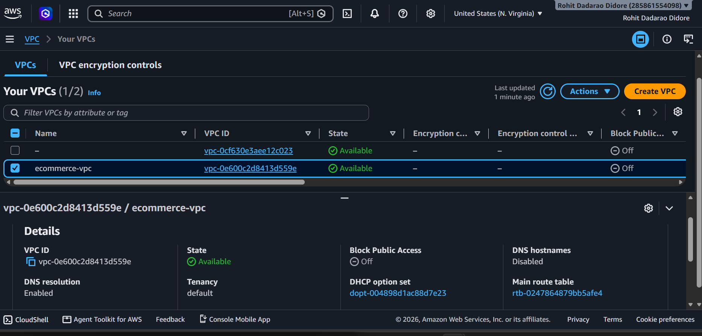
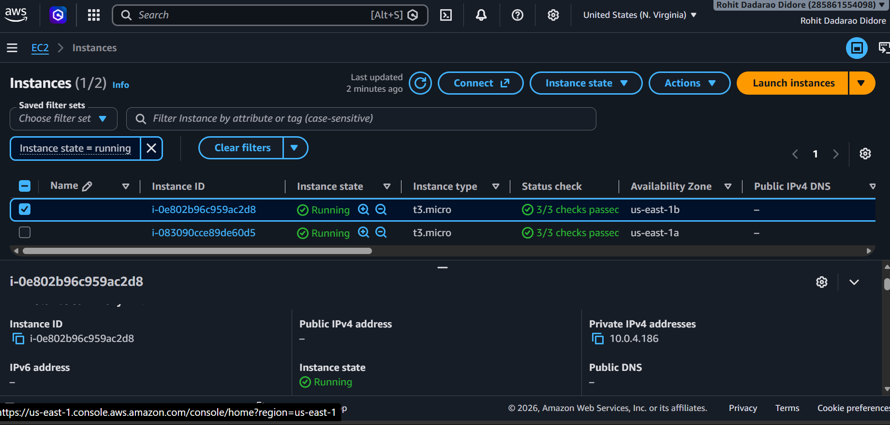
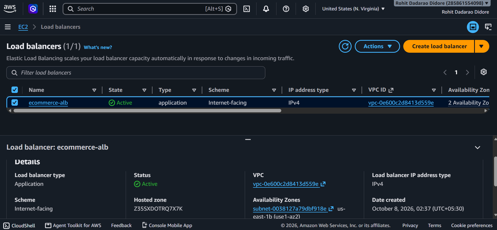
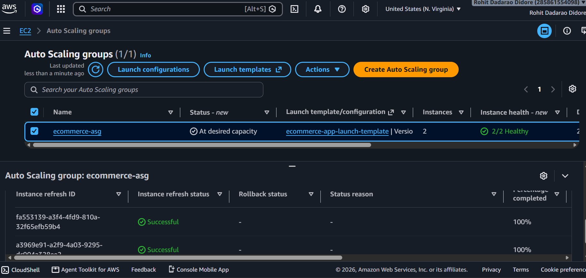
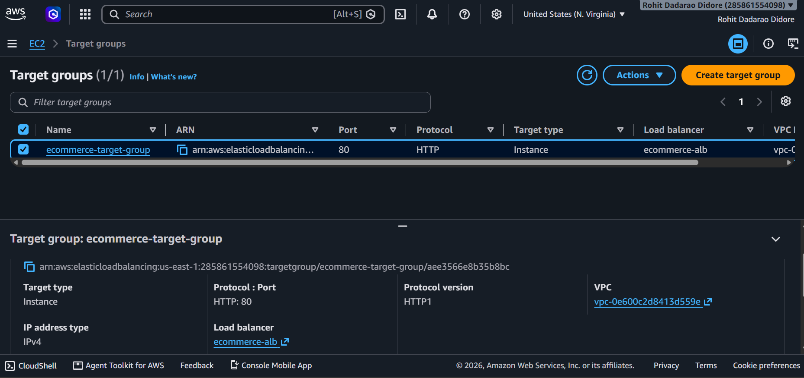
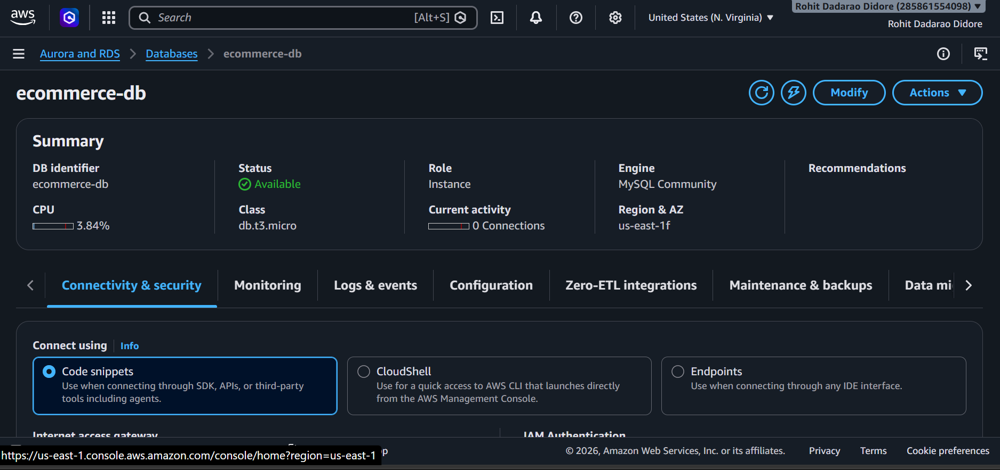

# AWS Auto-Scaling E-Commerce Platform 🚀

A highly available and scalable E-Commerce web application built using AWS cloud services.

## 📌 Project Overview

This project demonstrates a highly available 3-tier style web application architecture on AWS.

The application uses an Application Load Balancer to distribute incoming traffic across EC2 instances running in multiple Availability Zones. An Auto Scaling Group manages the application servers, while Amazon RDS MySQL is used as the database layer.

## 🏗️ Architecture

```text
                    Internet
                       |
                       v
              Application Load Balancer
                       |
                       v
                  Target Group
                  /           \
                 v             v
          EC2 Instance    EC2 Instance
          us-east-1a      us-east-1b
                 \             /
                  \           /
                   v         v
                    RDS MySQL

```
```

## 🎯 Project Objectives

* Build cloud infrastructure using AWS networking services.
* Distribute incoming HTTP traffic through an Application Load Balancer.
* Configure Auto Scaling to manage EC2 application instances.
* Deploy a MySQL database using Amazon RDS.
* Separate application and database access using security groups.
* Document the infrastructure and configuration through screenshots.

## 🛠️ AWS Services Used

| AWS Service                | Purpose                                |
| -------------------------- | -------------------------------------- |
| Amazon VPC                 | Creates an isolated cloud network      |
| Public and Private Subnets | Organizes resources by network access  |
| Amazon EC2                 | Runs application servers               |
| Application Load Balancer  | Distributes incoming traffic           |
| Auto Scaling Group         | Adjusts the number of EC2 instances    |
| Amazon RDS for MySQL       | Provides a managed relational database |
| Security Groups            | Controls inbound and outbound traffic  |

## 🧪 Deployment and Testing

### Deployment Components

* **Networking:** A VPC with public and private subnets across two Availability Zones.
* **Traffic Distribution:** An Application Load Balancer forwards HTTP requests to registered targets.
* **Compute:** An Auto Scaling Group manages EC2 application instances.
* **Database:** Amazon RDS for MySQL provides the relational database layer.
* **Security:** Security Groups control traffic between the load balancer, application instances, and database.

### Testing Checklist

* [x] Verify that the Application Load Balancer is reachable.
* [x] Verify that the Target Group reports healthy EC2 targets.
* [x] Confirm that the application page loads through the load balancer DNS name.
* [x] Verify that the Auto Scaling Group maintains the configured instance capacity.
* [x] Confirm that database connectivity works from the authorized application layer.

### Troubleshooting Notes

If a target becomes unhealthy, check the EC2 instance status, application service, health check path, listener and target group configuration, and Security Group rules.


## 📸 Project Screenshots

### AWS Architecture


### VPC



### EC2 Instances



### Application Load Balancer



### Auto Scaling Group



### Target Group



### RDS MySQL


